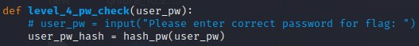
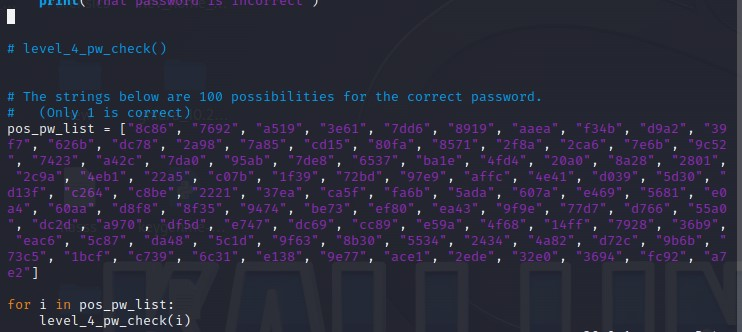

# PW Crack 3
AUTHOR: LT 'SYREAL' JONES
## Description
Can you crack the password to get the flag?
Download the password checker [here](https://artifacts.picoctf.net/c/21/level4.py) and you'll need the encrypted [flag](https://artifacts.picoctf.net/c/21/level4.flag.txt.enc) and the [hash](https://artifacts.picoctf.net/c/21/level4.hash.bin) in the same directory too.
There are 100 potential passwords with only 1 being correct. You can find these by examining the password checker script

hint:
```bash
# Read the python file.

# Modify the code like this and run it

python level4.py
```

And

<details>
<summary>Spoiler</summary>

picoCTF{fl45h_5pr1ng1ng_d770d48c}

</details>
